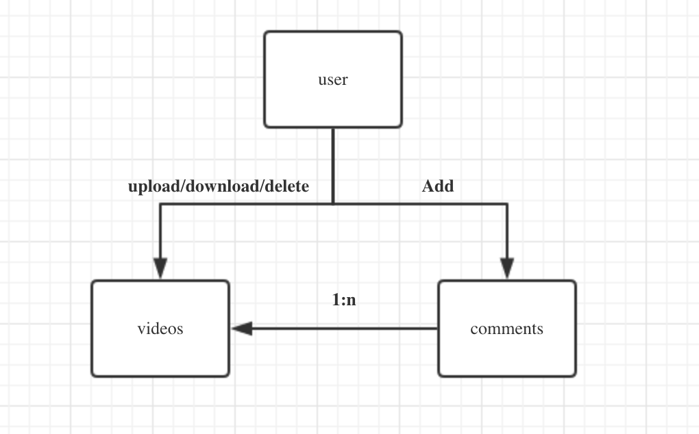

# videos-server
关系模型:


## API
- 创建(注册)用户: URL:/user Method: `POST` SC: `201,400,500`
- 用户登录: URL:/user/:username Method: `POST` SC: `200,400,500`
- 获取用户基本信息: URL:/user/:username Method: `GET` SC: `200,400,401,403,500`
- 用户注销: URL:/user/:username Metod: `DELETE` SC: `204,400,401,403,500`

## 用户资源
- list all videos: URL:/user/:username/videos Method: GET, SC 200,400,500
- get one videos: URL:/user/:username/videos/:vid-id Method: GET, SC: 200,400,500
- delete one video: URL:/user/:username/videos/:vid-id Method: DELETE,SC: 204,400,401,403,500

## 评论
- show comments: URL:/videos/:vid-id/comments Method: GET, SC:200,400,500
- delete a comment: URL:/videos/:vid-id/comment/:comment-id Method: TE SC:204,400,401,403,500
- post a comment: URL:/videos/:vid-id/comments Method:POST SC:201,400,500


## project layer
```
.
├── README.md
├── api
│   ├── dbops // 与数据库相关的操作
│   ├── defs // 存储一些定义API的消息结构,校验，返回的错误,以及所有需要提前定义的好的资源
│   ├── handlers.go
│   └── main.go // 主入口
├── go.mod
└── go.sum

```


## logic
```bash

handler -> validation{1.request,2.user} -> business logic -> response
```

1. data model
2. error handling


## database design
```mysql

```
